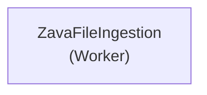

# Topology Graph: ZavaFileIngestion

Analyzed 1 service(s) across 1 repository(ies) for application "ZavaFileIngestion" on 2026-05-29 01:09 UTC.

## Services

## Service Details

| Service | Role | Language | Source Repository | Warnings |
|---------|------|----------|------------------|----------|
| ZavaFileIngestion | Worker | Java | ZavaFileIngestion | — |
